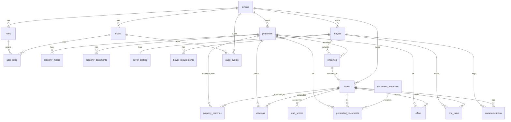
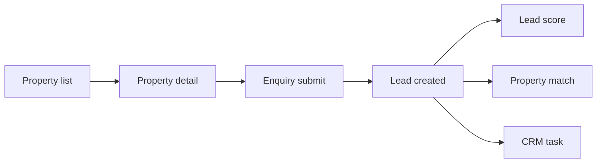

# LuxeMaurice AI — entity relationship diagram

Portable PostgreSQL schema v1 (spec-derived from client Drive v1–v14 thinking history).

```mermaid
erDiagram
  tenants ||--o{ users : has
  tenants ||--o{ roles : has
  tenants ||--o{ properties : owns
  tenants ||--o{ buyers : owns
  tenants ||--o{ leads : owns

  users ||--o{ user_roles : has
  roles ||--o{ user_roles : grants

  properties ||--o{ property_media : has
  properties ||--o{ property_documents : has

  buyers ||--|| buyer_profiles : has
  buyers ||--o{ buyer_requirements : has

  properties ||--o{ enquiries : receives
  buyers ||--o{ enquiries : submits
  enquiries ||--o| leads : converts_to

  leads ||--o{ lead_scores : scored_by
  leads ||--o{ property_matches : matched_to
  properties ||--o{ property_matches : matched_from

  leads ||--o{ viewings : schedules
  properties ||--o{ viewings : hosts

  leads ||--o{ offers : makes
  properties ||--o{ offers : on

  leads ||--o{ crm_tasks : tasks
  buyers ||--o{ crm_tasks : tasks

  document_templates ||--o{ generated_documents : renders
  leads ||--o{ generated_documents : for
  properties ||--o{ generated_documents : for

  leads ||--o{ communications : logs
  buyers ||--o{ communications : logs

  tenants ||--o{ audit_events : audits
  users ||--o{ audit_events : actor
```

## Core flow

```mermaid
flowchart LR
  A[Property list] --> B[Property detail]
  B --> C[Enquiry submit]
  C --> D[Lead created]
  D --> E[Lead score]
  D --> F[Property match]
  D --> G[CRM task]
```
