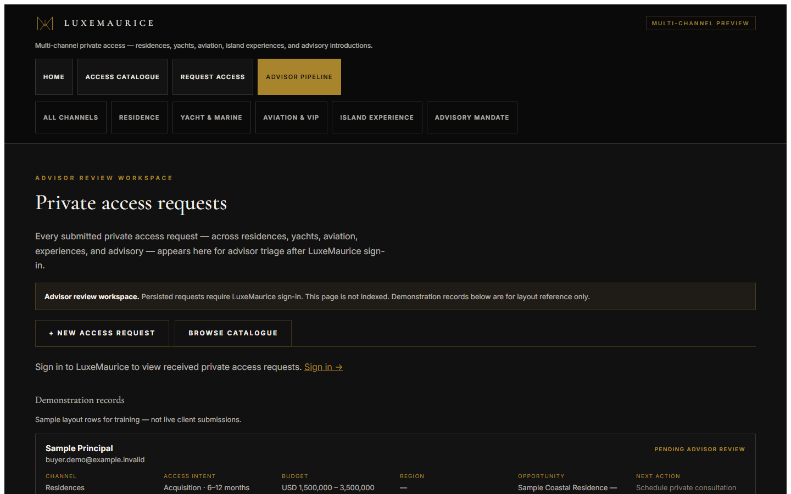
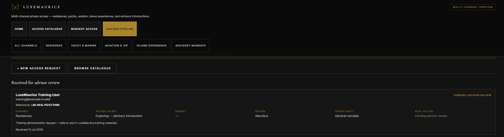

# LuxeMaurice AI — Advisor Review Guide

This guide explains how a LuxeMaurice advisor views **Private Access Requests** in the **Advisor review workspace**.

**Advisor Pipeline route:** `https://lux.corpflowai.com/client/luxe-maurice-ai/crm`

---

## 1. Sign in to the LuxeMaurice tenant

1. Open the LuxeMaurice site (`lux.corpflowai.com`).
2. Sign in with your **LuxeMaurice tenant** credentials.
3. Confirm you are on the LuxeMaurice workspace — not another tenant.

If you are not signed in, the Advisor Pipeline will not show persisted request details. Authenticated access is required for live request rows.

---

## 2. Open the Advisor Pipeline

1. In the LuxeMaurice AI navigation, select **Advisor pipeline** (Advisor review workspace).
2. The page is marked **Advisor review workspace** and is not indexed by search engines.
3. Canonical route: `https://lux.corpflowai.com/client/luxe-maurice-ai/crm`

*Figure 5 — Signed-out visitors see a sign-in prompt (no persisted client detail)*

---

## 3. Understand “Received for advisor review”

When signed in, the **Received for advisor review** section lists **persisted** Private Access Requests submitted through the live buyer form.

Each request shows **Pending advisor review** (or the current status) until your team updates workflow in the operator console.

*Figure 6 — Persisted request visible after LuxeMaurice sign-in*

---

## 4. Read the request fields

For each persisted request, review:

| Field | Purpose |
|-------|---------|
| **Reference** | `LM-REQ-…` — quote this with the client |
| **Name and email** | Contact details from the submission |
| **Contact number** | If provided |
| **Channel** | Access category (residence, yacht, aviation, etc.) |
| **Access intent** | Timing or mandate type |
| **Budget** | Stated range, if provided |
| **Region** | Preferred location |
| **Opportunity** | Linked catalogue item, if any |
| **Next action** | Current suggested step (e.g. Pending advisor review) |
| **Notes summary** | Short excerpt from client notes |
| **Received date** | When the request was submitted |

Handle all sensitive contact information according to your approved operating process.

---

## 5. Persisted requests vs Demonstration records

The page has two distinct sections:

| Section | What it is |
|---------|------------|
| **Received for advisor review** | **Live** submissions from the Private Access Request form — requires sign-in |
| **Demonstration records** | Fixed **training examples** for layout reference — not live client submissions |

*Figure 7 — Demonstration records (training layout only)*

**Rule:** Never treat Demonstration records as real client enquiries. They exist so advisors can see the card layout before live data is present.

---

## 6. What signed-out users can and cannot see

| Signed out | Signed in (LuxeMaurice tenant) |
|------------|--------------------------------|
| Advisor review workspace banner | Full **Received for advisor review** list |
| Sign-in prompt | Reference IDs, names, emails, and request fields |
| Demonstration records (sample layout) | All persisted requests for LuxeMaurice |
| **No** persisted request rows | |
| **No** real names, emails, phones, or LM-REQ references | |

This protects client privacy on a shared or public browser.

---

## 7. Current boundary — stage and notes

The Advisor Pipeline is a **review surface** and is **read-only** for workflow management today.

| Available in Advisor Pipeline | Available in `/change` (operator console) |
|------------------------------|---------------------------------------------|
| View persisted requests | Full LuxeMaurice lead list |
| Read status and next action summary | Update **stage**, **follow-up status**, **owner** |
| See notes summary | Add **internal notes** and **next action** date/note |
| | Save workflow changes from OPERATOR ACTIONS |

**Outbound email, WhatsApp, or SMS automation is not live.** Follow-up after review remains **human-led**.

**Planned future enhancement:** inline status changes and advisor assignment directly in the Advisor Pipeline. That is not live yet.

For now, after reviewing a request in the Advisor Pipeline, operators continue stage and notes work in **Change Console** on `/change`.

---

## Training example

Use the demonstration identity **LuxeMaurice Training User** (`training@example.invalid`) when recording advisor training materials. Do not display unrelated real client requests in shared materials.
