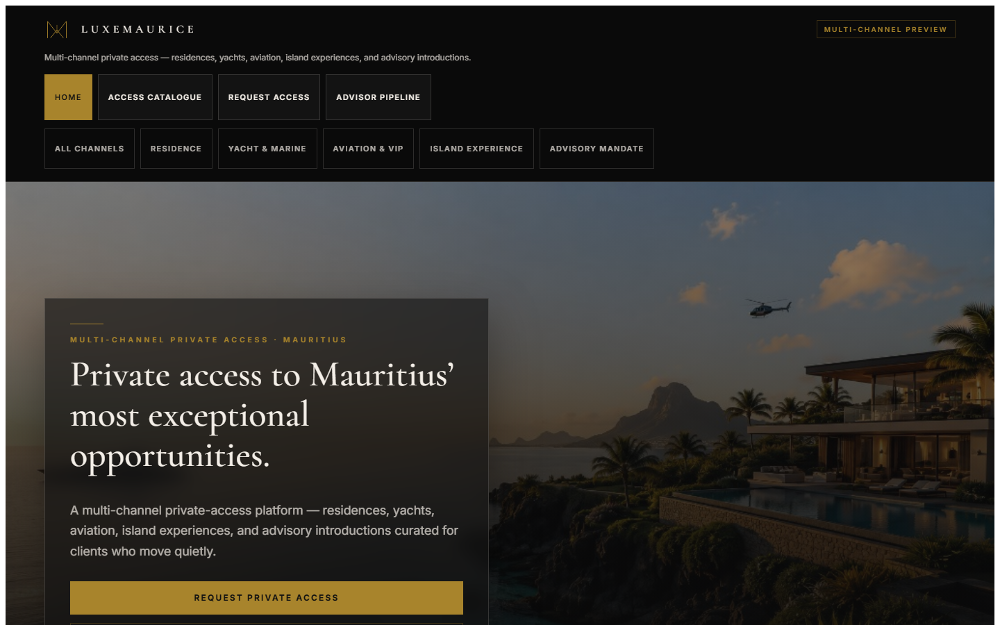
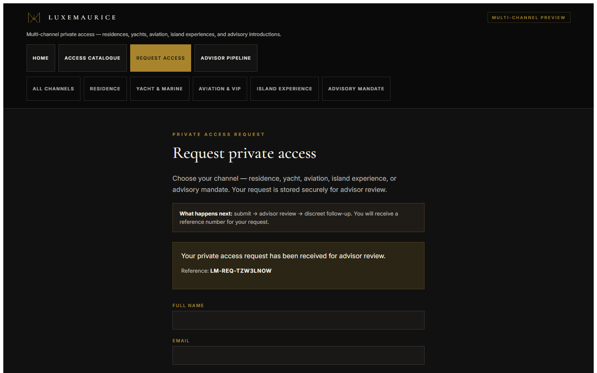

# LuxeMaurice AI — Private Access Request (Client Guide)

This guide explains how a principal or guest submits a **Private Access Request** on the live LuxeMaurice AI site.

**Live site:** `https://lux.corpflowai.com/client/luxe-maurice-ai`

---

## Journey at a glance

1. A prospective client visits LuxeMaurice AI.
2. They explore private opportunities in the access catalogue.
3. They submit a Private Access Request.
4. They receive an on-screen `LM-REQ-…` reference.
5. An authorised advisor reviews the request in the Advisor Pipeline.
6. The LuxeMaurice operator manages the lead through the internal Change Console workflow.
7. Follow-up remains **human-led** unless a separate messaging capability is later approved.

There is **no** automated email, WhatsApp, or SMS from the platform today.

---

## 1. Open the LuxeMaurice AI site

1. Open your browser.
2. Go to **LuxeMaurice AI** on the LuxeMaurice tenant site: `https://lux.corpflowai.com/client/luxe-maurice-ai`.
3. You will see the landing page with private access channels: residences, yachts, aviation, island experiences, and advisory introductions.

*Figure 1 — LuxeMaurice AI home*

---

## 2. Review private opportunity categories

1. From the home page, open **Access catalogue** (or **Private Opportunities**).
2. Browse categories that match your interest — residence, yacht, aviation, island experience, or advisory mandate.
3. Select an opportunity for more detail, or continue to a general access request.

Live catalogue route: `https://lux.corpflowai.com/client/luxe-maurice-ai/properties`

*Figure 2 — Access catalogue*

---

## 3. Open the Private Access Request form

1. Select **Request access** in the navigation.
2. The **Private access request** form opens at `https://lux.corpflowai.com/client/luxe-maurice-ai/buyer`.
3. If you arrived from a specific opportunity, the form may pre-select that category or opportunity.

*Figure 3 — Request access form*

---

## 4. Complete the form

Fill in the fields that apply to your enquiry:

| Field | Guidance |
|-------|----------|
| **Full name** | Required |
| **Email** | Required — your advisor uses this for discreet follow-up |
| **Contact number** | Optional |
| **Desired category** | Residence, yacht, aviation, island experience, or advisory |
| **Access budget** | Optional range in USD |
| **Location / region** | e.g. West Coast, Grand Baie |
| **Preference detail** | Optional — e.g. villa size, yacht length |
| **Specific opportunity** | Optional — link to a catalogue item |
| **Access intent / timing** | e.g. ready within 3 months, seasonal window |
| **Notes** | Any context you want the advisor to see |

---

## 5. Submit the request

1. Review your entries.
2. Select **Submit access request**.
3. Wait for the confirmation message — do not close the page until it appears.

---

## 6. Receive your LM-REQ reference

On success you will see:

- A confirmation message: **Your private access request has been received for advisor review.**
- A **reference number** in the form `LM-REQ-…` (for example `LM-REQ-ABC12345`).

Keep this reference for your records. Quote it in any follow-up with your advisor.

*Figure 4 — Confirmation and LM-REQ reference*

---

## 7. What happens after submission

| Step | What you can expect |
|------|---------------------|
| **Received** | Your request is stored securely for LuxeMaurice advisor review |
| **Advisor review** | A private advisor reviews category, intent, budget, and notes |
| **Operator workflow** | Stage and notes are managed internally in Change Console |
| **Discreet follow-up** | An advisor contacts you using the details you provided — **human-led** |
| **No platform messaging automation** | You will not receive an automated email, WhatsApp, or SMS from the system today |

Your request is **not** published publicly. Only authorised LuxeMaurice advisors can view persisted request details after sign-in.

---

## Training example (safe for demonstrations)

When practising or recording training materials, use demonstration details only:

- **Name:** LuxeMaurice Training User  
- **Email:** training@example.invalid  
- **Category:** Residences  
- **Region:** Mauritius  
- **Notes:** Training demonstration request — safe to use in LuxeMaurice training materials.

Do not use real client names, emails, or phone numbers in training recordings.
