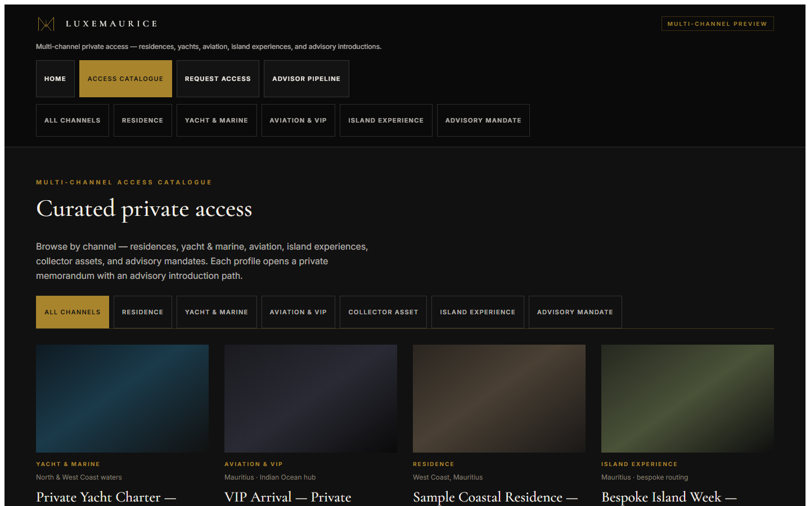
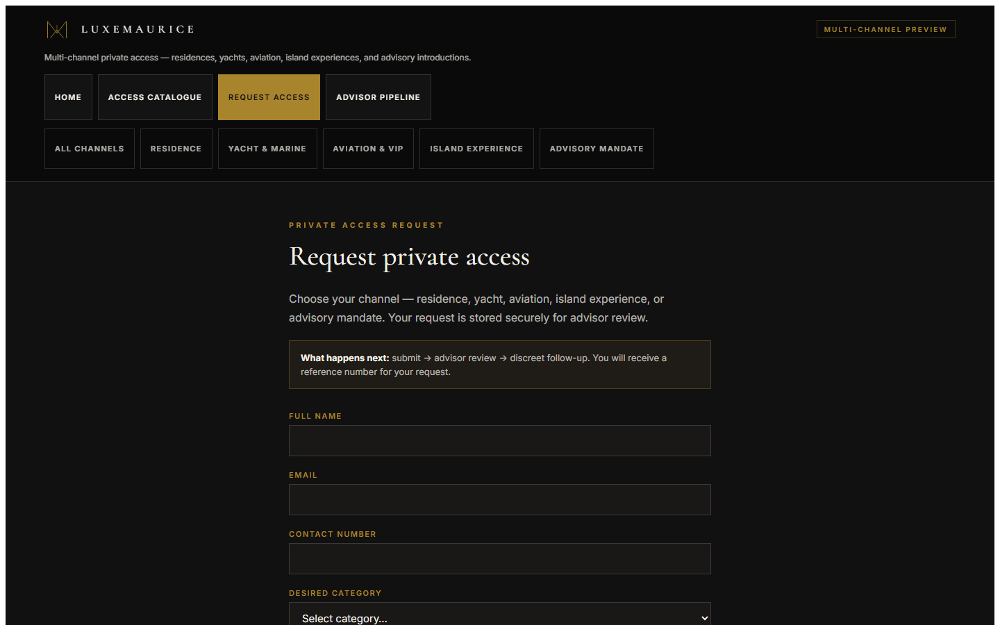
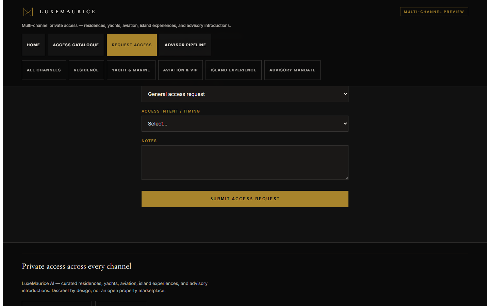
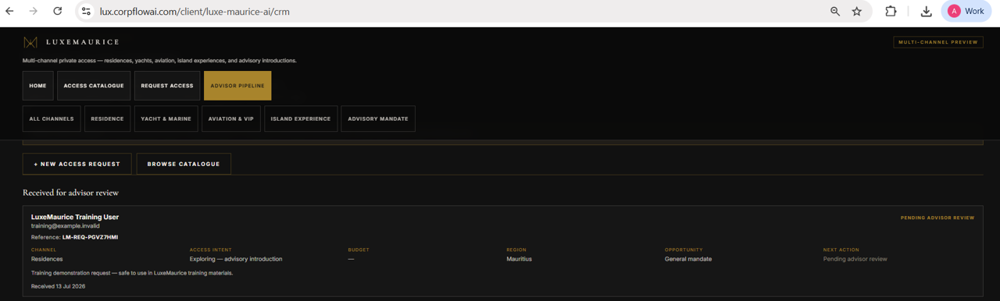
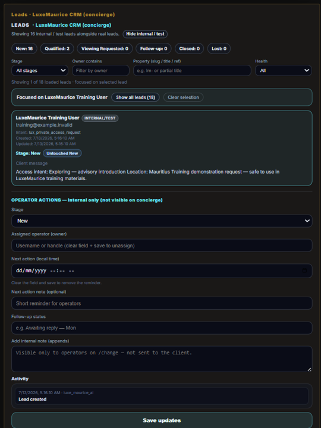

# LuxeMaurice Training Pack — Review Edition

**Single entry point for Anton review.**  
**Recipient when approved:** Jan / LuxeMaurice  
**Status:** review and packaging only — **no external send has occurred**

Use this document (or the generated [`LUXEMAURICE_TRAINING_PACK_REVIEW.html`](./LUXEMAURICE_TRAINING_PACK_REVIEW.html)) as the primary review surface. Record corrections in [`ANTON_REVIEW_CHANGES.md`](./ANTON_REVIEW_CHANGES.md).

---

## Where to view

### Live product surfaces (production)

These are the **canonical** live routes. Short aliases such as `/private-opportunities`, `/private-access`, and `/advisor/pipeline` are **not** live product URLs for this pack.

| Surface | URL |
|---------|-----|
| Landing | `https://lux.corpflowai.com/client/luxe-maurice-ai` |
| Access catalogue | `https://lux.corpflowai.com/client/luxe-maurice-ai/properties` |
| Private Access Request | `https://lux.corpflowai.com/client/luxe-maurice-ai/buyer` |
| Advisor Pipeline | `https://lux.corpflowai.com/client/luxe-maurice-ai/crm` |
| Change Console (operator) | `https://lux.corpflowai.com/change` |

### Repository artifacts (not public website pages)

Files under `artifacts/luxe-maurice-training-pack-v1/` are for **Anton review and packaging**. They are not published automatically as HTML routes on the live site.

Draft Jan package (send gated): [`../client-delivery-preparation/`](../client-delivery-preparation/)

---

## 1. Pack purpose

Prepare a truthful, client-safe training set that explains the **live** LuxeMaurice Private Access Request workflow:

- how a principal or guest submits a request;
- how an authorised advisor reviews persisted requests;
- how an operator manages stage and notes in Change Console;
- what is live today versus what remains a planned future enhancement.

The pack supports a short guided walkthrough, then practical use on the live platform.

---

## 2. Intended recipient: Jan / LuxeMaurice

Jan and the LuxeMaurice team receive **only** materials from the Anton-approved Jan package under [`../client-delivery-preparation/`](../client-delivery-preparation/), after Anton explicitly approves client-send preparation and, separately, any actual external send.

Until then, drafts and review files stay internal.

---

## 3. Current product capabilities

| Capability | Live today |
|------------|------------|
| Private Access Request form | Yes — `/client/luxe-maurice-ai/buyer` |
| On-screen `LM-REQ-…` reference | Yes |
| Secure persistence for LuxeMaurice requests | Yes |
| Advisor Pipeline (authenticated review) | Yes — `/client/luxe-maurice-ai/crm` |
| Signed-out privacy (no persisted client detail) | Yes |
| Operator list and workflow updates in `/change` | Yes |
| Focused selected-lead list + OPERATOR ACTIONS | Yes |
| Access catalogue browsing | Yes — `/client/luxe-maurice-ai/properties` |

---

## 4. Current limitations

| Limitation | Status |
|------------|--------|
| Advisor Pipeline is **read-only** for stage / notes | Confirmed |
| Outbound **email** automation | **Not live** |
| Outbound **WhatsApp** automation | **Not live** |
| Outbound **SMS** automation | **Not live** |
| Automated client confirmation message | **Not live** |
| Automated advisor notification | **Not live** |
| Inline advisor assignment / status editing in Advisor Pipeline | **Not live** |
| Follow-up after submission | **Human-led** by the LuxeMaurice team |

**No external send has occurred from this pack.** Drafts under client-delivery-preparation are text only.

---

## 5. Advisor workflow summary

1. Sign in to the LuxeMaurice tenant on `lux.corpflowai.com`.
2. Open **Advisor pipeline** → `/client/luxe-maurice-ai/crm`.
3. Review rows under **Received for advisor review** (persisted submissions).
4. Distinguish **Demonstration records** (layout examples only) from live requests.
5. Do not expect outbound email / WhatsApp / SMS from the system today.
6. Stage, owner, and notes changes are done in Change Console (`/change`), not in the Advisor Pipeline.

Full guide: [`../02-advisor-workflow-guide/ADVISOR_REVIEW_GUIDE.md`](../02-advisor-workflow-guide/ADVISOR_REVIEW_GUIDE.md)

---

## 6. Operator workflow summary

1. Open `/change` with appropriate access.
2. Locate **LEADS · LuxeMaurice CRM (concierge)**.
3. Find the training or client row (use **Show internal / test** when locating the training row).
4. **Select the lead** — the list focuses on that row; **OPERATOR ACTIONS** appears directly below.
5. Update stage, owner, next action, or notes where supported; save.
6. Use focus controls correctly:

| Control | Result |
|---------|--------|
| **Show all leads** | Restores the full list; selection stays highlighted |
| **Clear selection** | Clears selection and exits focus |
| **Focus list on this lead** | Re-collapses the list after browsing |

Full guide: [`../03-operator-workflow-guide/OPERATOR_CHANGE_WORKFLOW.md`](../03-operator-workflow-guide/OPERATOR_CHANGE_WORKFLOW.md)

---

## 7. Graphics 01–08 (in sequence)

Captures live under [`../05-graphics/captures/`](../05-graphics/captures/). Manifest: [`../05-graphics/GRAPHICS_MANIFEST.md`](../05-graphics/GRAPHICS_MANIFEST.md).

### 01 — Landing page


*Private gateway channels and introduction.*

### 02 — Access catalogue



*Browse private opportunities by category.*

### 03 — Private Access Request form



*Single request path for all channels.*

### 04 — Confirmation and LM-REQ reference



*On-screen confirmation with fictional training data.*

### 05 — Advisor sign-in prompt


*Signed-out visitors see no persisted client detail.*

### 06 — Advisor Pipeline with training request



*Authenticated review of the LuxeMaurice Training User request. Browser chrome cropped · privacy reviewed · ready for Anton review.*

### 07 — Demonstration records


*Layout examples only — not live client submissions.*

### 08 — Change Console focused lead + OPERATOR ACTIONS



*Select lead → list focuses → OPERATOR ACTIONS below. Cropped to training lead and operator actions.*

---

## 8. Complete guides

| Guide | Path |
|-------|------|
| Client Private Access | [`../01-client-review-guide/CLIENT_PRIVATE_ACCESS_GUIDE.md`](../01-client-review-guide/CLIENT_PRIVATE_ACCESS_GUIDE.md) |
| Advisor Review | [`../02-advisor-workflow-guide/ADVISOR_REVIEW_GUIDE.md`](../02-advisor-workflow-guide/ADVISOR_REVIEW_GUIDE.md) |
| Operator Change Workflow | [`../03-operator-workflow-guide/OPERATOR_CHANGE_WORKFLOW.md`](../03-operator-workflow-guide/OPERATOR_CHANGE_WORKFLOW.md) |
| Backend status & limitations | [`../06-backend-status/BACKEND_STATUS_AND_LIMITATIONS.md`](../06-backend-status/BACKEND_STATUS_AND_LIMITATIONS.md) |

---

## 9. Video scripts

| Script | Path |
|--------|------|
| Video 1 — Client journey | [`../04-training-video-scripts/VIDEO_01_CLIENT_JOURNEY.md`](../04-training-video-scripts/VIDEO_01_CLIENT_JOURNEY.md) |
| Video 2 — Advisor journey | [`../04-training-video-scripts/VIDEO_02_ADVISOR_JOURNEY.md`](../04-training-video-scripts/VIDEO_02_ADVISOR_JOURNEY.md) |
| Video 3 — Operator workflow | [`../04-training-video-scripts/VIDEO_03_OPERATOR_WORKFLOW.md`](../04-training-video-scripts/VIDEO_03_OPERATOR_WORKFLOW.md) |

---

## 10. Anton’s requested changes

Record and track every correction here:

→ [`ANTON_REVIEW_CHANGES.md`](./ANTON_REVIEW_CHANGES.md)

How the loop works: [`README.md`](./README.md) (change-response loop).

---

## 11. Final approval checklist

Leave all items unchecked until Anton confirms.

```text
[ ] Pack purpose and tone are appropriate for Jan
[ ] Capabilities and limitations match live behaviour
[ ] Advisor and operator steps are accurate
[ ] Graphics 01–08 are clear and privacy-safe (fictional training data only)
[ ] Graphic 06 browser-chrome crop accepted (completed: BROWSER_CHROME_CROPPED)
[ ] Guides and video scripts are ready
[ ] Anton changes in ANTON_REVIEW_CHANGES.md addressed or none outstanding
[ ] Approved for client-send preparation
[ ] Approved for actual external send
[ ] No client send has occurred
```

---

## 12. External send statement

**No email, WhatsApp, or SMS has been sent.**  
**Outbound messaging automation is not live.**  
**Draft messages under client-delivery-preparation remain drafts until Anton explicitly approves an actual external send.**

---

## Training data used in graphics and demos

| Field | Value |
|-------|-------|
| Name | LuxeMaurice Training User |
| Email | training@example.invalid |
| Phone | leave blank |
| Category | Residences |
| Intent | Exploring — advisory introduction |
| Region | Mauritius |
| Notes | Training demonstration request — safe to use in LuxeMaurice training materials. |
