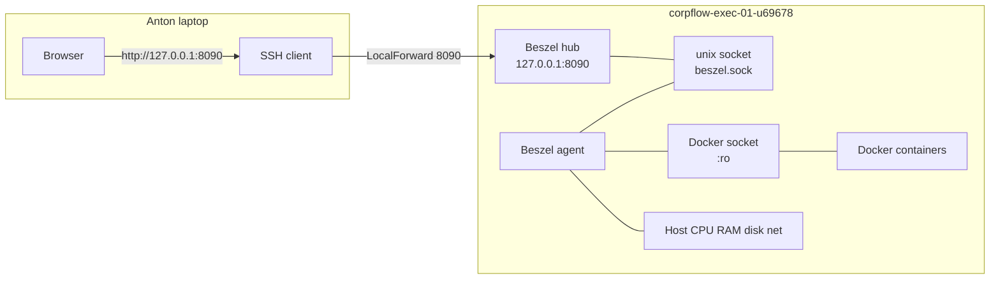

# Beszel server-utilisation pilot (corpflow-exec-01)

**Packet id:** `beszel-utilisation-pilot-on-exec01`  
**Source issue:** [#727](https://github.com/antonvdberg-bit/corpflow-ai-command-center/issues/727)  
**Status:** v1 — **docs + scaffold only**. Pilot is **not installed** and **not live**.  
**Owner:** Authorship = Cursor (L1); L3 install = Anton (protected, separate approval); Review = Anton.  
**Target host:** `corpflow-exec-01-u69678`  
**Recommendation (this packet):** **pilot** — not adopt, not reject.

**Companion docs:**

- `docs/operations/MONITORING_ARCHITECTURE.md` — component map (Uptime Kuma #13, Backup Health #14).
- `docs/runbooks/UPTIME_KUMA_ON_EXEC01_INSTALL_RUNBOOK_V1.md` — loopback + SSH-tunnel access pattern this pilot mirrors.
- `docs/operations/BACKUP_HEALTH_MONITOR.md` — Monitor #14 (restic → R2 correctness).
- `docs/operations/SELF_HOSTED_OPS_R2_RESTIC.md` — backup jobs (heartbeat + retention).
- `docs/operations/SERVER_AGENT_ACCESS_AND_EXECUTION_BOUNDARY_V1.md` — L1/L3 boundary; any install requires a named carve-out + Anton approval.
- `docs/operations/SERVER_SAFETY_BASELINE_AND_CHATWOOT_DECISION_V1.md` — self-hosted tool hold posture.
- `ops/beszel/compose.example.yml` — non-secret example Compose scaffold (not auto-deployed).

---

## 1. Purpose

Prepare the smallest safe Beszel pilot packet so Anton can eventually view **CorpFlowAI server utilisation** on `corpflow-exec-01-u69678` **without interactive SSH shell sessions for routine checks**.

Required future visibility (after a separate L3 install):

| Signal | Role |
|---|---|
| Host CPU | utilisation + short trends |
| Memory / RAM | utilisation, pressure indicators where available |
| Disk | usage + disk-pressure indicators |
| Network | host network usage where supported |
| Docker / containers | container CPU/RAM where safely enabled |
| History | short history / trends in the Beszel GUI |
| Alerts | low-noise thresholds **only after** a 48-hour baseline (§ 8–§ 9) |

### What Beszel supplements (does not replace)

| Existing surface | What it answers | Canonical doc |
|---|---|---|
| **Uptime Kuma (Monitor #13)** | Is the public floor / n8n health **reachable**? | `docs/runbooks/UPTIME_KUMA_ON_EXEC01_INSTALL_RUNBOOK_V1.md` |
| **Backup Monitor #14** | Is the **restic → R2** ops backup healthy (age, count, size)? | `docs/operations/BACKUP_HEALTH_MONITOR.md` |
| **restic / R2 jobs** | Do backups **run** (heartbeat + retention)? | `docs/operations/SELF_HOSTED_OPS_R2_RESTIC.md` |
| **Supplier / host console** | External CPU / network-style graphs from the hoster | operator console (not in-repo) |

**Supplier graphs** may show external CPU or network data. **Guest RAM** and **Docker/container** visibility generally require **in-server** tooling (this pilot). Beszel does **not** prove backup correctness and does **not** replace availability probes.

### Where Anton will see what (acceptance answers)

| Question | Answer after this PR (before any L3 install) | Answer after future L3 Beszel install |
|---|---|---|
| Where will Anton see **server utilisation**? | Nowhere live yet — this packet is docs/scaffold only. | Beszel GUI via **SSH local-port-forward** to loopback `127.0.0.1:8090` (same access pattern as Kuma on `:3001`). |
| Where will Anton see **backup health**? | Still **SSH** (`journalctl` / `backup-health.log` / timer status) and **Telegram failure-only** once #14 timer is enabled — **not** inside Beszel. | Same unless the follow-up **Ops Health** packet lands (see § 11). |

---

## 2. Non-goals

Explicitly **out of scope** for this packet and for the first L3 install:

- ❌ No replacement of Uptime Kuma.
- ❌ No replacement of Backup Monitor #14.
- ❌ No broad Grafana / Prometheus / OpenObserve / Langfuse / similar observability programme.
- ❌ No application code changes (`api/`, `lib/`, `components/`, `pages/`, etc.).
- ❌ No database or schema changes; no `POSTGRES_URL` / Neon work.
- ❌ No client-data access.
- ❌ No public dashboard by default (no DNS, no reverse proxy, no `0.0.0.0` bind).
- ❌ No paid SaaS subscription.
- ❌ No immediate Telegram / external alert fan-out.
- ❌ No server reboot.
- ❌ No claim that the pilot is live.
- ❌ No merge or production deployment from Cursor.
- ❌ No automatic deployment from this repo.
- ❌ No weakening of Docker security beyond the **documented, mitigated** read-only socket mount required by Beszel’s agent model (§ 4).

---

## 3. Architecture

### 3.1 Chosen shape (pilot)

**Hub + agent on the same host** (`corpflow-exec-01-u69678`), Docker Compose, loopback-only hub UI.

Rationale:

- Matches the existing Kuma pattern (single-box supporting service, private access).
- Beszel’s documented same-host model uses a **unix socket** between hub and agent, avoiding a public agent port.
- One box = one utilisation view for the CorpFlowAI exec node Anton cares about first.



### 3.2 Components

| Component | Role |
|---|---|
| **Beszel hub** | PocketBase-backed GUI; stores short history; admin login. Binds **`127.0.0.1:8090` only**. |
| **Beszel agent** | Collects host + (optional) Docker metrics; talks to hub via **shared unix socket** (`LISTEN=/beszel_socket/beszel.sock`). |
| **Browser GUI** | Opened on Anton’s laptop through an SSH tunnel — never a public URL in v1. |
| **Safe metrics path** | Agent → unix socket → hub → loopback HTTP → SSH tunnel → browser. |
| **Docker metrics** | Agent mounts `/var/run/docker.sock:ro` **only if** enabled for the pilot; socket must **not** be reachable from any internet-facing service. |
| **Private access** | SSH `-L 8090:127.0.0.1:8090` (mirror of Kuma’s `-L 3001:localhost:3001`). |

### 3.3 Upstream reference

Official same-host Compose shape (unix socket + agent `network_mode: host`): [Beszel getting started](https://beszel.dev/guide/getting-started).  
This packet adapts that shape for CorpFlowAI: **loopback bind**, **named project/containers/volumes**, **placeholders only**, **no auto-deploy**.

---

## 4. Access and security model

### 4.1 Default access: private (required)

| Control | Pilot rule |
|---|---|
| Hub bind | `"127.0.0.1:8090:8090"` — never `:8090` alone |
| Public DNS / reverse proxy | **Forbidden** for v1 |
| Unauthenticated public port | **Forbidden** |
| GUI access | SSH tunnel only |
| Agent ↔ hub | Unix socket on a private volume (preferred) |
| Admin account | Created once in the GUI over the tunnel; password in Anton’s password manager only |
| Secrets in git | **Never** — use `ops/beszel/.env.example` placeholders only |

Example tunnel (operator laptop):

```bash
ssh -L 8090:127.0.0.1:8090 anton@<EXEC01_SSH_HOST>
# then open http://127.0.0.1:8090 in a local browser
```

`<EXEC01_SSH_HOST>` is the operator-known SSH target for `corpflow-exec-01-u69678` (same host used for Uptime Kuma). Do not invent alternate public hostnames for Beszel.

### 4.2 Risk register (pilot)

| Risk | Mitigation |
|---|---|
| **Dashboard exposure** | Loopback bind + SSH tunnel; verify with off-box curl timeout (same K2 pattern as Kuma). |
| **Docker socket** | Mount **read-only**; only on the agent container; hub has **no** Docker socket; never expose hub/agent publicly while the socket is mounted. Prefer unix-socket hub↔agent so the agent does not need a published TCP port. |
| **Admin account** | Strong unique password; never paste into chat, git, or runbook blocks. |
| **KEY / TOKEN** | Generated in hub UI when adding a system; stored only in server-local env file mode `600` (not in repo). |
| **Firewall** | Do not open 8090/tcp publicly. Confirm `ss -tlnp` shows `127.0.0.1:8090` only. |
| **Least privilege** | Separate Compose project `corpflowai-beszel`; do not attach to ERPNext / Kuma networks; do not mount CorpFlow secrets or Postgres. |
| **Host networking (agent)** | Beszel’s documented agent model uses `network_mode: host` for accurate host metrics. Justified for this pilot; does **not** publish the hub. Hub remains loopback-published via Compose ports. |
| **How Anton accesses without weakening the server** | Keep using SSH keys he already has; add **no** new public listener; add **no** Cloudflare tunnel / reverse proxy in v1. |

### 4.3 Later exposure (explicitly deferred)

Authenticated HTTPS behind an approved internal proxy is a **future ADR**, not this pilot. Until then: localhost + SSH tunnel only.

---

## 5. Installation checklist (L3 — Anton only; not executed by Cursor)

> **Hard rule:** Cursor does **not** SSH to `corpflow-exec-01-u69678` and does **not** run these commands. Installation is a **future protected Anton action** after PR review + explicit approval.  
> Commands must not stop existing app containers, restart the server, alter Uptime Kuma, alter Backup Monitor #14, alter backups, expose an unauthenticated public service, or display secrets.

### 5.0 Preconditions (before any paste)

- [ ] This runbook is on `main` (or the approved merge SHA).
- [ ] Separate **authorization** exists for a Beszel carve-out (ADR / packet / Anton approval) — Kuma’s carve-out does **not** authorize Beszel (`SERVER_AGENT_ACCESS_AND_EXECUTION_BOUNDARY_V1.md` § 5.5 is Kuma-only today).
- [ ] Anton has a strong Beszel admin password ready in a password manager (never pasted into chat).
- [ ] Capacity headroom checked (`free -h`, `df -h /`) — expect Beszel hub+agent on the order of **tens to low hundreds of MiB** combined; abort if RAM pressure is already critical.
- [ ] Local laptop has free bind for `localhost:8090` (or use `-L 8091:127.0.0.1:8090`).

### 5.1 Pre-flight (on the box)

```bash
hostname
# Expected: corpflow-exec-01-u69678

nproc
free -h
df -h /

docker version --format 'Server: {{.Server.Version}} | Client: {{.Client.Version}}'
docker compose version

# Existing workloads must remain Up — do not stop/recreate them.
docker ps --format 'table {{.Names}}\t{{.Status}}\t{{.Ports}}'

# Confirm no prior Beszel project
docker ps -a --filter 'name=corpflowai-beszel' --format '{{.Names}} | {{.Status}}'
docker compose ls 2>/dev/null | grep -i beszel || echo "no prior beszel compose project — ok"

# Port 8090 free on loopback path
ss -tlnp 2>/dev/null | grep ':8090 ' || echo "port 8090 free — ok"

# Uptime Kuma still healthy (must remain untouched)
docker ps --filter 'name=uptime-kuma' --format '{{.Names}} {{.Status}} {{.Ports}}'

# Backup health timer presence (Monitor #14) — read-only check
systemctl --user list-timers --all 2>/dev/null | grep backup-health || echo "backup-health timer not listed (may still be L3-pending) — ok to note"
systemctl --user list-timers --all 2>/dev/null | grep corpflowai-ops-restic || true
```

If pre-flight is unexpected, **stop**.

### 5.2 Create directories

```bash
mkdir -p "$HOME/corpflowai-beszel/beszel_data"
mkdir -p "$HOME/corpflowai-beszel/beszel_socket"
mkdir -p "$HOME/corpflowai-beszel/beszel_agent_data"
chmod 700 "$HOME/corpflowai-beszel" "$HOME/corpflowai-beszel/beszel_data" "$HOME/corpflowai-beszel/beszel_agent_data"
chmod 700 "$HOME/corpflowai-beszel/beszel_socket"
```

### 5.3 Place example Compose (from repo) and local env

Prefer copying the reviewed example from the repo checkout on the box:

```bash
REPO="${HOME}/corpflow-ai-command-center"   # adjust if clone path differs
test -f "$REPO/ops/beszel/compose.example.yml"

mkdir -p "$HOME/corpflowai-beszel"
cp "$REPO/ops/beszel/compose.example.yml" "$HOME/corpflowai-beszel/compose.yaml"
cp "$REPO/ops/beszel/.env.example" "$HOME/corpflowai-beszel/.env"
chmod 600 "$HOME/corpflowai-beszel/.env"

# Edit .env on the box only — fill KEY/TOKEN after hub first-login (§ 5.5).
# Never commit the filled .env. Never paste KEY/TOKEN into chat.
```

**Pin images before first production-ish pull:** `ops/beszel/compose.example.yml` ships pinned to `henrygd/beszel:0.18.7` / `henrygd/beszel-agent:0.18.7` at authorship. Confirm tags/digests at install time (`docker pull` + `docker image inspect`). Patch bumps within `0.18.x` may be operator-reviewed; minor/major bumps need a runbook refresh.

### 5.4 Start hub only (first)

```bash
cd "$HOME/corpflowai-beszel"
# KEY/TOKEN may still be placeholders — start hub first.
docker compose -p corpflowai-beszel up -d corpflowai-beszel-hub

sleep 20
docker ps --filter 'name=corpflowai-beszel' --format 'table {{.Names}}\t{{.Status}}\t{{.Ports}}'
# Expected PORTS for hub: 127.0.0.1:8090->8090/tcp
```

### 5.5 First login + system registration (operator GUI)

On the laptop:

```bash
ssh -L 8090:127.0.0.1:8090 anton@<EXEC01_SSH_HOST>
```

1. Open `http://127.0.0.1:8090`.
2. Create the **admin** account (password manager only).
3. **Add System** for this host using the unix socket path documented by Beszel for same-host Compose (typically `/beszel_socket/beszel.sock` — confirm in the hub dialog / current Beszel docs).
4. Copy the generated **KEY** and **TOKEN** into `$HOME/corpflowai-beszel/.env` on the server (mode `600`). Do not echo them.
5. Start the agent:

```bash
cd "$HOME/corpflowai-beszel"
docker compose -p corpflowai-beszel up -d
docker ps --filter 'name=corpflowai-beszel' --format 'table {{.Names}}\t{{.Status}}\t{{.Ports}}'
```

### 5.6 What this install must NOT do

```bash
# Do NOT run any of the following as part of this pilot:
# docker stop $(docker ps -q)
# docker system prune
# systemctl reboot
# any edit to ~/uptime-kuma/ or the uptime-kuma compose project
# any disable of corpflowai-ops-backup-health.timer or restic timers
# any publish of 0.0.0.0:8090
```

---

## 6. Verification checklist

Run after install (Anton). Record PASS/FAIL without secrets.

### 6.1 Beszel containers

```bash
docker ps --filter 'name=corpflowai-beszel' --format 'table {{.Names}}\t{{.Status}}\t{{.Ports}}'
# Expect hub + agent Up; hub PORTS must start with 127.0.0.1:8090
```

### 6.2 GUI via approved private path

```bash
# On box:
curl -fsS --max-time 5 -o /dev/null -w '%{http_code}\n' http://127.0.0.1:8090/
# Expect 200 or 302 (login redirect) — not connection refused

# Off box (must FAIL to connect publicly):
curl -I --connect-timeout 8 http://<EXEC01_PUBLIC_IP>:8090
# Expect timeout / connection refused — same class of signal as Kuma K2
```

Laptop: with SSH tunnel up, browser reaches login / dashboard at `http://127.0.0.1:8090`.

### 6.3 Metrics appear

In the Beszel GUI (via tunnel), confirm for `corpflow-exec-01-u69678`:

- [ ] CPU
- [ ] RAM
- [ ] Disk / disk pressure
- [ ] Network (where supported)
- [ ] Docker/container stats (only if socket mount enabled)

### 6.4 Existing monitoring untouched

```bash
docker ps --filter 'name=uptime-kuma' --format '{{.Names}} {{.Status}} {{.Ports}}'
# Expect uptime-kuma still Up (healthy) on 127.0.0.1:3001

systemctl --user status corpflowai-ops-backup-health.timer --no-pager || true
systemctl --user list-timers --all | grep -E 'backup-health|corpflowai-ops-restic' || true
# Expect restic timers still present; backup-health as previously configured

# Prove no unintended public listeners for Beszel
ss -tlnp 2>/dev/null | grep -E ':8090|:45876' || true
# 8090 must be 127.0.0.1 only; prefer no public agent TCP if using unix socket
```

### 6.5 No collateral container damage

```bash
docker ps --format 'table {{.Names}}\t{{.Status}}'
# Compare to pre-flight list — existing corpflowai-* / uptime-kuma containers still Up
# Do not recreate unrelated containers
```

### 6.6 CorpFlowAI routes unaffected

From the laptop (public internet):

```bash
curl -fsS -o /dev/null -w '%{http_code}\n' https://core.corpflowai.com/api/factory/health
curl -fsS -o /dev/null -w '%{http_code}\n' https://corpflowai.com/
# Expect 200 (or the normal healthy codes for those floors)
```

---

## 7. Rollback plan

Remove **only** Beszel pilot components. Preserve volumes initially.

### 7.1 Stop and remove containers (keep data)

```bash
cd "$HOME/corpflowai-beszel"
docker compose -p corpflowai-beszel down
# Does NOT use docker system prune
# Does NOT remove unrelated containers/networks
```

### 7.2 Optional: remove pilot files (data preserved)

```bash
# Keep ~/corpflowai-beszel/beszel_data unless deliberate deletion is requested
# Optional remove of compose/env only:
#   rm -f "$HOME/corpflowai-beszel/compose.yaml" "$HOME/corpflowai-beszel/.env"
```

### 7.3 Deliberate volume deletion (only if Anton requests)

```bash
# ONLY when Anton explicitly asks to wipe pilot data:
# docker volume ls | grep corpflowai-beszel || true
# rm -rf "$HOME/corpflowai-beszel/beszel_data"   # irreversible local hub DB
```

### 7.4 Close pilot-only exposure

```bash
ss -tlnp 2>/dev/null | grep ':8090 ' || echo "8090 closed — ok"
# No reverse-proxy / DNS steps should have been added; if any were, remove them (they are out of policy).
```

### 7.5 Prove survivors healthy

```bash
docker ps --filter 'name=uptime-kuma' --format '{{.Names}} {{.Status}} {{.Ports}}'
systemctl --user list-timers --all | grep -E 'backup-health|corpflowai-ops-restic' || true
docker ps --format 'table {{.Names}}\t{{.Status}}' | head -n 50
curl -fsS -o /dev/null -w '%{http_code}\n' https://core.corpflowai.com/api/factory/health
```

**Forbidden rollback commands:** `docker system prune`, deleting all unused volumes, stopping all containers, removing shared networks without proof of ownership.

---

## 8. Forty-eight-hour observation plan

For the first **48 hours** after a successful L3 install:

| Record | Notes |
|---|---|
| Idle + peak CPU | Screenshot or note from Beszel charts |
| Idle + peak RAM | Include whether swap is touched |
| Memory pressure / swap | `free -h` samples 2–3×/day if GUI unclear |
| Disk usage + growth | Especially `/` and Docker disk |
| Network baseline | Quiet vs busy windows |
| Key container utilisation | `uptime-kuma`, ERPNext-related containers if present, Beszel itself |
| Beszel overhead | Extra RAM/CPU attributable to hub+agent |
| Missing / misleading metrics | Document gaps (e.g. disk I/O, cgroup oddities) |

**Do not** enable broad Telegram or external alert fan-out during observation.  
**Do not** page on short spikes.  
Keep Uptime Kuma and Backup Monitor #14 alert paths unchanged.

---

## 9. Initial alert recommendations (after baseline only)

Enable **low-noise** thresholds only after § 8 notes exist. Short spikes must **not** page Anton.

| Condition | Suggested starting posture | Notes |
|---|---|---|
| Sustained high RAM | Alert if RAM **> 90% for ≥ 15–30 min** | Tune from 48h peaks |
| Sustained CPU pressure | Alert if CPU **> 85–90% for ≥ 15–30 min** | Ignore seconds-long spikes |
| Sustained disk pressure | Alert on sustained high util / IO wait if Beszel exposes it | Correlate with `df` |
| Disk capacity | Alert if root filesystem **≥ 85–90%** full | Capacity, not spike |
| Host unreachable | Prefer **existing** Uptime Kuma / future third-location packet | Beszel on-box cannot reliably alert if the box is down |
| Critical container down | Only for a **named** allowlist (e.g. `uptime-kuma`) after baseline | Avoid chatty Docker event spam |

v1 preference: keep Beszel alerts **off** until baseline is written down; continue relying on Kuma for availability and #14 for backup failure-only Telegram.

---

## 10. Decision packet

| Field | Value |
|---|---|
| **Recommendation** | **pilot** |
| **Chosen architecture** | Hub + agent on `corpflow-exec-01-u69678`; unix socket; Docker Compose; loopback hub |
| **Access method** | SSH local-port-forward to `127.0.0.1:8090` |
| **Expected server overhead** | Lightweight — plan for on the order of **~50–200+ MiB** RAM combined and low idle CPU; measure during § 8 |
| **Risks** | Docker socket RO mount; agent host network; memory pressure on a busy box; accidental public bind if Compose edited wrongly; false sense that Beszel covers backups |
| **Exact protected action Anton must later approve** | L3 install on `corpflow-exec-01-u69678` per § 5 **after** a Beszel carve-out authorization (ADR/packet) — pull images, write local compose/env, start `corpflowai-beszel` project, create admin user, register agent, run § 6 verification |
| **Evidence required before calling the pilot live** | § 6 all PASS; 48h observation notes started; Uptime Kuma still healthy; backup timers unchanged; `127.0.0.1:8090` only; no public 8090; Delivery Reality Audit updated with live tunnel evidence |

---

## 11. Backup Health indicator / Ops Health dashboard follow-up

### 11.1 Why this section exists

Beszel monitors **utilisation**, not **backup correctness**. This pilot must not imply that Beszel replaces Monitor #14.

| Layer | Responsibility |
|---|---|
| Beszel | CPU, RAM, disk, network, containers, trends |
| Backup Monitor #14 | restic/R2 reachable, latest snapshot age, snapshot count, plausible size, failure-only Telegram |
| Uptime Kuma | Availability / reachability |

### 11.2 Desired Backup Health indicator (future GUI — not Beszel-native)

Beszel does **not** natively display CorpFlowAI’s backup-health status artifact. Recommend a **separate internal Ops Health** page/card (follow-up issue) that reads a **sanitized local status file** produced by Monitor #14 (or a thin exporter beside it).

Desired fields:

| Field | Source (sanitized) |
|---|---|
| status | `green` / `amber` / `red` / `unknown` |
| latest backup-health monitor run time | timer/service / log |
| latest snapshot time | Monitor #14 parse (no secrets) |
| latest snapshot age | derived |
| snapshot count | derived |
| latest status message | last line of `~/.local/state/corpflowai-ops/backup-health.log` (no env dumps) |
| timer enabled + waiting | `systemctl --user list-timers` for `corpflowai-ops-backup-health.timer` |
| Telegram posture | reminder: **failure-only** |

### 11.3 Safest implementation path (follow-up)

1. Extend Monitor #14 (or a sibling script) to write a **mode-600/640** JSON/text status artifact with **only** the fields above — never `RESTIC_PASSWORD`, never raw env, never R2 keys.
2. Do **not** query R2 from a public dashboard.
3. Do **not** expose the artifact on a public URL.
4. Serve the indicator on an **internal** Ops Health surface (SSH-tunneled or authenticated operator-only route) — **not** inside public marketing pages.
5. Until that lands, Anton continues to see backup health via:
   - `tail -n 20 ~/.local/state/corpflowai-ops/backup-health.log`
   - `systemctl --user status corpflowai-ops-backup-health.timer`
   - Telegram **only on failure** (once the #14 timer is enabled)

### 11.4 Follow-up tracking

GitHub follow-up: **[#735 — ops: Ops Health Backup indicator (sanitized status from Monitor #14)](https://github.com/antonvdberg-bit/corpflow-ai-command-center/issues/735)**  
Cross-link from `MONITORING_ARCHITECTURE.md` future packet `ops-health-backup-indicator`.

---

## 12. Explicit non-actions (this PR / Cursor session)

- no merge
- no production deployment
- no server installation
- no env/secrets change on the box
- no DB/schema change
- no client data
- no public dashboard
- no alert fan-out
- no paid tool
- no server restart

**ANTON ACTION:** NONE for PR review. A separate protected approval will be required before any server installation.

---

## 13. Change log

- **2026-08-04** — Initial docs + scaffold packet for #727 (pilot recommendation; not live).
