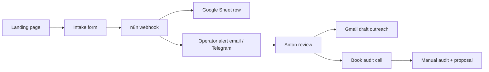

# Product A — Revenue machine implementation plan (v1)

**Product:** AI-ready website rebuild / website migration + enquiry capture + Lead Rescue for **US medspas, aesthetic clinics, and elective clinics**.

**Status:** Implementation plan — **manual-first v1**. No production runtime authorized by this doc alone.

**Anchor sentinel:** `<!-- PRODUCT_A_REVENUE_MACHINE_V1 -->`

<!-- PRODUCT_A_REVENUE_MACHINE_V1 -->

**Revision note (2026-06-20):** v1 stack is **Google Workspace + n8n + CorpFlowAI intake**. No third-party CRM, pipeline builder, or marketing-automation platform in the first version.

**Revision note (2026-06-22):** Anton decisions captured — **Langfuse** is part of Product A measurement from the start; **Chatwoot** is the standard website chat/live-chat/conversation inbox (not the CRM); **GoHighLevel** is legacy/migration-away only; **Twenty vs EspoCRM** is the CRM replacement bake-off; **social scheduling** requires candidate discovery (do not default to Mixpost); **AgentSpan** verified at agentspan.ai but watch/revisit only. **No install or production config authorized by this revision.**

**Revision note (2026-06-30):** Mauritius property **premium tier** documented in `docs/marketing/PRODUCT_A_MAURITIUS_PROPERTY_OFFER_V1.md` — separate funnel from the USD 150 Lead Rescue wedge; US `/product-a/us-clinics` unchanged. Runtime `/product-a/mauritius` ships only after doctrine reconciliation merges.

---

Define the **smallest revenue machine** that can sell and deliver Product A without over-building infrastructure before the sales motion is proven.

**North star for v1:** a clinic owner can request an audit, Anton receives a clean lead record, and follow-up stays human-approved and traceable.

**Explicit deferral:** internal CRM inside CorpFlowAI Command Center is **future-only** — after manual workflow proves repeatability (see § 8).

---

## 2. Product A offer (buyer-facing)

| Element | v1 definition |
| ------- | ------------- |
| **Who** | US medspas, aesthetic clinics, elective clinics (Botox/fillers, laser, body contouring, med-spa skincare, elective wellness with booking friction). |
| **What** | AI-ready website rebuild or migration + enquiry capture hardening + Lead Rescue operating workflow (human operator, not a chatbot pitch). |
| **Primary CTA** | **Request a Website & Lead Rescue Audit** |
| **Outcome promise (allowed)** | Enquiries become visible, captured, and followed up — without forcing a CRM migration on day one. |
| **Outcome promise (forbidden)** | Guaranteed revenue, “never miss a lead again” (unqualified), fully automated sales machine. See `docs/marketing/BRAND_AND_CONVERSION_DOCTRINE.md`. |

Product A is **above-the-line**: managed workflow + website delivery for a vertical, not a generic AI wrapper. See `docs/strategy/ABOVE_THE_LINE_STRATEGY_DOCTRINE.md`.

---

## 3. Hard rules — v1 operations + strategic direction (non-negotiable)

### 3.1 v1 operations (unchanged until operator closeout)

**First live intake motion** uses only the replacement stack in § 4 for pre-sale pipeline. Do not add hosted marketing-form drip-automation or calendar-to-external-CRM sync in v1.

That means **no** (for v1 live intake):

- Third-party CRM pipelines or deal stages wired to intake
- Hosted marketing forms tied to external CRM
- Drip automations, SMS blasts, or workflow-builder dependencies on external platforms
- Calendar booking widgets that sync into external CRM
- UI copy, docs, or automation specs that imply an all-in-one marketing platform

**v1 pre-sale source of truth:** Google Sheet (operator CRM) + Postgres only where CorpFlowAI native intake already exists.

### 3.2 Strategic direction (2026-06-22 — docs capture)

| Topic | Direction |
| ----- | --------- |
| **GoHighLevel** | **Legacy / migration-away only.** Do not position GHL as system of record. Do not build new strategic dependency on GHL. Existing GHL at client sites (e.g. Living Word) is a decommission target, not a CorpFlow spine. |
| **CRM** | **Twenty vs EspoCRM bake-off** — see § 16. Prefer maintained product sets over custom CRM development. GHL-native CRM is not an option. |
| **Conversation inbox** | **Chatwoot** is CorpFlowAI's standard website chat / live chat / conversation inbox. Chatwoot is **not** the CRM. |
| **AI observability** | **Langfuse** from the start for Product A AI traceability — see § 15. |
| **Social scheduling** | **Candidate discovery** — Postiz, Mixpost, and other maintained product sets; do not default to Mixpost; GHL-native social scheduling is **not** an option — see § 17. |
| **AgentSpan** | Verified at https://agentspan.ai — durable execution runtime for AI agents. **WATCH / REVISIT** only; not a Product A immediate dependency — see § 18. |

---

## 4. Replacement stack (v1 + strategic layers)

| Layer | Tool | Role |
| ----- | ---- | ---- |
| **Temporary CRM / pipeline** | Google Sheets | Single operator sheet — all pre-sale and in-audit leads until delivery handoff **or** CRM bake-off winner is authorized. |
| **Workflow spine** | n8n | Intake webhook → Sheet append → operator notification → optional Gmail draft creation. Hardening process mandatory before expanding secret-touching workflows. See `docs/product/PRODUCT_RADAR_CANDIDATES.md` § n8n hardening. |
| **Outreach** | Gmail drafts | Human-approved email only — operator reviews and sends. No auto-send in v1. |
| **Audit calls** | Google Calendar **or** simple booking link (Calendly / Google Appointment Schedule) | Audit scheduling only; no CRM sync required. |
| **Intake surface** | CorpFlowAI native landing + form **or** Google Form (fallback) | Public capture; fields in § 6. |
| **Knowledge base** | Google Drive docs | Offer copy, audit checklist, objection handling, delivery SOPs, vertical notes. |
| **Conversation inbox (standard)** | **Chatwoot** (target) | Website chat / live chat / human handoff inbox — **not** CRM. Pilot: medspa demo inbox; n8n sync after hardening. |
| **AI observability (required)** | **Langfuse** (target) | Traces for Lead Rescue drafts, classification, handoff — from sandbox pilot onward. See § 15. |
| **CRM (future — bake-off)** | **Twenty** or **EspoCRM** | Replacement for GHL + Sheets when bake-off completes — see § 16. |
| **Legacy (migration-away)** | GoHighLevel | Existing client widgets only; no new CorpFlow dependency; decommission path per tenant. |
| **Future CRM (optional)** | CorpFlowAI Command Center | **After** manual motion is proven — not v1. |

---

## 5. v1 revenue flow (keep it simple)



**Step-by-step (v1):**

1. **Landing page** — Product A page with primary CTA *Request a Website & Lead Rescue Audit*.
2. **Intake form submit** — required fields captured (§ 6).
3. **Automation** — n8n receives payload → appends row to Google Sheet → notifies Anton (email and/or existing ops alert path).
4. **Anton review** — qualify/disqualify within 2 business days; update Sheet status column.
5. **Manual follow-up** — Gmail draft (review → send); offer audit call via Calendar link.
6. **Audit → close** — manual proposal; payment and delivery handoff per existing CorpFlow finance/runbook patterns when applicable.

**No branching automations in v1.** No lead scoring, no multi-step drips, no chatbot on the Product A page unless separately authorized.

---

## 6. Landing page + intake requirements

### 6.1 Primary CTA

- Button / hero action: **Request a Website & Lead Rescue Audit**
- Secondary (optional): *See what the audit covers* → anchor to on-page section or Drive doc summary link.

### 6.2 Required intake fields

| Field | Required | Notes |
| ----- | -------- | ----- |
| Clinic name | Yes | Legal or public-facing brand name. |
| Website URL | Yes | Current site; `https://` validated. |
| Contact name | Yes | Owner, manager, or marketing lead. |
| Email | Yes | Primary follow-up address. |
| Phone | No | Optional; US format hint in UI. |
| City / state | Yes | US clinic location (dropdown or text + state). |
| Biggest enquiry/booking problem | Yes | Free text; sales qualification signal. |

### 6.3 Post-submit UX

- Confirmation message: intake received; Anton (or CorpFlowAI) will review within 2 business days.
- No payment on page in v1.
- No external CRM thank-you redirect.
- Privacy: minimal — email used for audit scheduling only (align with site privacy policy).

### 6.4 Intake implementation options (pick one for v1)

| Option | Pros | Cons |
| ------ | ---- | ---- |
| **A — CorpFlowAI native form** | Brand control, can POST to `/api/automation/ingest` + n8n forward | Requires small runtime PR |
| **B — Google Form** | Fastest live; Sheets native | Weaker on-brand UX |

**Default recommendation:** Option A if a Product A route ships in the same sprint; Option B for same-day live test.

### 6.5 Visual standard (non-negotiable — first adopter)

Product A / US Clinics is the **first surface to adopt** `docs/marketing/CORPFLOW_VISUAL_STANDARD_HUMAN_FIRST_BEAUTY_LAYER.md`. The page (`components/ProductAUsClinicLanding.js`, route `/product-a/us-clinics`) must present a **beautiful, audience-appropriate photographic background** (refined clinic interiors, calm luxury treatment environments, premium skincare / aesthetic / wellness imagery, or tasteful abstract luxury) with content on **"3D glass"** frosted panels, layered (photo → scrim → glass cards → CTA), visually compelling within four seconds before the copy is read.

Constraints (do not trade away for beauty): primary CTA *Request a Website & Lead Rescue Audit* stays the most prominent above-the-fold action; WCAG AA contrast on glass over the worst-case region of the photo; optimized responsive images with no LCP/CLS regression; mobile-first; `prefers-reduced-motion` / `prefers-reduced-transparency` respected. No identifiable patients, no fabricated before/after, no clinical PII; every background photo is a governed asset per `docs/marketing/CORPFLOW_ASSET_GOVERNANCE.md`. The reusable "photo + glass" component/token system (built per the visual standard § 6) is reused here first, then rolled into other public surfaces — not re-styled one-off. The detailed build plan — primitives, a11y/perf checks, asset governance, and additive Plausible before/after measurement — is `docs/product/PRODUCT_A_BEAUTY_LAYER_IMPLEMENTATION_PACKET_V1.md`. The intake API, event contract, and form field names/required behaviour are **unchanged** by the beauty layer. Runtime restyle is gated work (`.cursor/rules/delivery-reality.mdc`).

---

## 7. Google Sheet — temporary CRM schema

**Sheet name:** `Product A — US Clinic Leads` (operator copy in Google Drive).

| Column | Example | Notes |
| ------ | ------- | ----- |
| `received_at` | ISO timestamp | n8n writes on ingest |
| `status` | `new` / `reviewing` / `audit_scheduled` / `audit_done` / `proposal_sent` / `won` / `lost` / `nurture` | Manual updates by Anton |
| `clinic_name` | | From intake |
| `website` | | From intake |
| `contact_name` | | From intake |
| `email` | | From intake |
| `phone` | | Optional |
| `city_state` | | From intake |
| `biggest_problem` | | From intake |
| `source` | `product-a-landing` | UTM / referrer if available |
| `audit_call_at` | | Filled after booking |
| `notes` | | Operator free text |
| `next_action` | | e.g. *Send audit recap*, *Follow up Friday* |

**Rules:**

- Sheet is the **only** pre-sale pipeline in v1.
- Do not mirror into Command Center cockpit until buyer is active/paying (future handoff rules in § 8).
- Back up weekly (Drive version history is sufficient for v1).

---

## 8. n8n workflow spec (v1)

**Workflow name:** `product-a-us-clinic-intake-v1`

**Trigger:** Webhook POST (from native form or Google Form via Apps Script / n8n Google Form trigger).

**Steps:**

1. **Validate payload** — required fields present; reject incomplete with 400 + log.
2. **Append Google Sheet row** — map fields to § 7 columns; set `status=new`.
3. **Notify operator** — email to Anton and/or `corpflow.ops_alert.v1` forward per `docs/operations/TELEGRAM_ALERT_WIRING_PACKET_V1.md` pattern (best-effort).
4. **Create Gmail draft (optional, off by default)** — template: audit acknowledgement + Calendar link placeholder. Operator must enable node only after template review.

**Idempotency:** dedupe on `email + clinic_name + received_at` window (24h) to prevent double-submit noise.

**Event type (if using native ingest):** `intake.product_a.us_clinic.v1` via `POST /api/automation/ingest` per `docs/automation-framework.md`.

**Explicitly out of scope for this workflow:**

- Auto-send email
- CRM deal creation
- SMS / WhatsApp
- Payment links
- LLM enrichment of lead records

---

## 9. Gmail draft outreach (human-approved)

**v1 pattern:** n8n or operator creates **draft only**; Anton sends from Gmail after review.

**Draft A — intake acknowledgement (within 2 business days):**

- Subject: `Re: Website & Lead Rescue audit — {clinic_name}`
- Body: thank you; 1–2 sentences reflecting `biggest_problem`; link to book audit call; sign-off from Anton.

**Draft B — post-audit follow-up:**

- Summary of audit findings (3 bullets max); proposed scope (website + capture + Lead Rescue); no pricing guarantee language.

Store canonical templates in Google Drive: `Product A / Sales / Email templates v1`.

---

## 10. Audit call booking

**v1 options (choose one):**

| Option | Setup |
| ------ | ----- |
| Google Calendar appointment schedule | Free; lives on Anton’s calendar |
| Calendly free tier | Single event type: *Website & Lead Rescue Audit (30 min)* |

**Rules:**

- Booking link appears in acknowledgement email and optionally on thank-you page.
- No bi-directional CRM sync — operator copies `audit_call_at` into Sheet manually or via n8n Calendar trigger (optional v1.1).

---

## 11. Google Drive — knowledge base layout

```
Product A/
├── Offer/
│   ├── one-pager-website-lead-rescue-audit.md
│   └── audit-deliverable-checklist.md
├── Sales/
│   ├── email-templates-v1.md
│   ├── discovery-questions-us-clinics.md
│   └── objection-handling.md
├── Delivery/
│   ├── website-migration-checklist.md
│   ├── enquiry-capture-audit.md
│   └── lead-rescue-handoff-to-operator.md
└── Vertical/
    └── us-medspa-notes.md
```

Drive is **draft + operator reference** — repo runbooks remain production doctrine when they exist (e.g. Lead Rescue operator runbook for delivery phase).

---

## 12. Implementation phases

### Phase 0 — Docs + Sheet + Drive (same day)

- [ ] Create Google Sheet schema (§ 7)
- [ ] Create Drive folder structure (§ 11)
- [ ] Write audit checklist + email templates in Drive
- [ ] Confirm n8n webhook URL + Google Sheets credential on operator n8n instance

### Phase 1 — Intake live (target: 1–3 days)

- [x] Product A landing page with § 6 fields and primary CTA — `/product-a/us-clinics`
- [x] Form POST → `/api/product-a/intake` → automation forward + optional `N8N_PRODUCT_A_INTAKE_WEBHOOK_URL`
- [x] Payload spec + operator deploy checklist — `docs/product/PRODUCT_A_INTAKE_WEBHOOK.md`
- [ ] **Operator closeout:** deploy + one live test (checklist in webhook doc § *Operator deployment checklist*)
- [ ] Plausible / analytics event on submit (optional; `pa_intake_*` events wired in component)

### Phase 2 — Manual sales motion (target: first 5 audits)

- [ ] Anton runs 5 audit calls from Sheet-sourced leads
- [ ] Track conversion: intake → audit → proposal → paid
- [ ] Refine copy and audit checklist from real calls
- [ ] Document repeatable delivery steps in Drive

### Phase 3 — Delivery integration (only after first paid client)

- [ ] Hand off paid client to Lead Rescue delivery runbooks where applicable (`docs/operations/AI_LEAD_RESCUE_OPERATOR_RUNBOOK.md`, paid pilot onboarding)
- [ ] Website rebuild/migration as separate statement of work
- [ ] Still no external CRM — Sheet row moves to `won` + delivery checklist

### Phase 1.5 — Sandbox pilots (docs-authorized direction; install requires packet)

- [ ] Langfuse sandbox + medspa enquiry pilot flow (§ 15.2) — synthetic data only
- [ ] Chatwoot demo medspa inbox pilot scoped (§ 19) — after n8n hardening baseline
- [ ] CRM bake-off sandbox scripts for Twenty and EspoCRM (§ 16)

### Phase 4 — CRM + inbox production (future gate)

**Gate criteria (all required):**

- ≥ 3 paid Product A clients **or** ≥ 10 qualified audits with documented repeat playbook
- Sheet + n8n motion documented and boring (no weekly firefighting)
- Anton explicit DECISION authorizing cockpit pipeline for Product A

**Future scope (not v1):**

- CRM bake-off winner as system of record (Twenty or EspoCRM)
- Chatwoot production inbox wired to Product A / Lead Rescue handoff
- Langfuse production traces with PII policy
- `/admin/product-a` or extended lead-rescue pipeline for US clinic vertical
- Postgres as system of record; Sheet retired or read-only archive

---

## 13. UI / copy guardrails

- Never show third-party CRM logos or “integrated with …” badges on Product A surfaces.
- **Never position GoHighLevel** as system of record, strategic partner, or required integration.
- CTA language stays audit-first, not “Buy now” or “Start automation.”
- Lead Rescue references must match managed-workflow doctrine — not chatbot-first.
- US clinic page is separate from Mauritius Lead Rescue surfaces unless explicitly cross-linked.
- Chatwoot may be referenced as conversation inbox / handoff layer — not as CRM.

---

## 15. Langfuse — Product A AI observability (required from the start)

**Status:** Direction captured — **no install authorized by this doc alone.**

Langfuse must be included in Product A **from the start** for AI traceability across Lead Rescue, receptionist, chatbot, and operator-agent workflows.

### 15.1 Required trace fields

Every Product A AI step that touches a lead or enquiry should emit a Langfuse trace (or span) including, where applicable:

| Field | Notes |
| ----- | ----- |
| Lead / enquiry input | Redacted snapshot or reference id — no raw PII in sandbox pilot |
| Prompt version | Version id or hash of prompt template used |
| Model / provider | e.g. `openai/gpt-4o`, `groq/...` |
| Classification | Intent, fit score, urgency, route decision |
| Generated response / draft | Operator-facing draft text or summary |
| Escalation / handoff decision | Human vs auto; Chatwoot inbox vs email vs none |
| Latency | End-to-end and per-step ms |
| Cost | Token or $ estimate where provider exposes it |
| Final outcome | Where available: booked, replied, lost, escalated |

### 15.2 Sandbox pilot (bounded — no real client data)

**Flow:** medspa enquiry → classification → Lead Rescue draft → handoff decision → outcome → **Langfuse trace**.

| Step | Pilot rule |
| ---- | ---------- |
| Enquiry | Synthetic or operator-authored test enquiry only |
| Classification | Logged to Langfuse with prompt version |
| Lead Rescue draft | Human-review posture; trace retained |
| Handoff decision | Record Chatwoot vs email vs none in trace metadata |
| Outcome | Operator marks test outcome for eval dataset |
| Langfuse | Sandbox instance or cloud project — **not** production `POSTGRES_URL` |

**Gate:** separate authorization packet before production client data or tenant traces.

---

## 16. CRM replacement bake-off — Twenty vs EspoCRM

**Status:** Evaluation track — **no install authorized by this doc alone.**

GoHighLevel is **not** the long-term CRM. Product A and CorpFlow client operations should migrate to a **maintained open CRM product set**, not custom CRM development.

### 16.1 Candidates

| Candidate | URL | Notes |
| --------- | --- | ----- |
| **Twenty** | https://twenty.com/ | AI-oriented open CRM; modern UX; Postgres-based |
| **EspoCRM** | https://www.espocrm.com/ | Mature OSS CRM; broad entity model; PHP stack |

**Not in bake-off:** GoHighLevel (legacy only), custom in-repo CRM as first choice.

### 16.2 Evaluation scenario (operator bake-off script)

Run the same scenario on each candidate in a **sandbox** with synthetic data:

1. **Prospect** created from website enquiry
2. **Company / contact** linked
3. **Website audit** note attached
4. **Fit score** field or tag
5. **Outreach status** updated (draft sent, replied, no response)
6. **Booked call** on calendar or task
7. **Proposal** stage
8. **Onboarding** checklist started
9. **Follow-up task** assigned

**Preference:** choose a **maintained product set** that covers the scenario without bespoke CorpFlow CRM code.

### 16.3 Gate

- Bake-off completes before any production client CRM migration.
- Winner requires ADR + authorization packet + security review.
- Until then, Google Sheet remains pre-sale pipeline for Product A v1.

---

## 17. Social scheduling — candidate discovery track

**Status:** Discovery — **no default vendor; no install authorized by this doc alone.**

Do **not** default to Mixpost. Do **not** use GHL-native social scheduling.

### 17.1 Candidates (initial list)

| Candidate | URL | Status |
| --------- | --- | ------ |
| **Postiz** | https://postiz.com/ | Discovery |
| **Mixpost** | https://mixpost.app/ | Discovery — one candidate, not default |
| *Others* | TBD | Add maintained product sets as discovered |

**Scope for first pilot (when authorized):** internal CorpFlowAI accounts only; no client accounts until API/platform policy reviewed.

---

## 18. AgentSpan — watch / revisit

**Status:** `WATCH / REVISIT` — **not** a Product A immediate dependency.

| Item | Value |
| ---- | ----- |
| **URL** | https://agentspan.ai (verified 2026-06-22) |
| **Category** | Durable execution runtime for AI agents |
| **Product A** | Out of scope for v1 and sandbox pilot |
| **Constraints** | No connection to production credentials or client data |
| **Revisit gate** | After Langfuse + Chatwoot + CRM bake-off complete |

See also `docs/product/PRODUCT_RADAR_CANDIDATES.md` § AgentSpan.

---

## 19. Chat / inbox direction — Chatwoot standard

**Chatwoot** is CorpFlowAI's **standard** website chat, live chat, and conversation inbox layer.

| Rule | Detail |
| ---- | ------ |
| Chatwoot **is** | Omnichannel inbox, website widget, pre-chat forms, human handoff |
| Chatwoot **is not** | CRM, system of record, or replacement for Twenty/EspoCRM bake-off winner |
| Product A pilot | Demo medspa inbox: widget → classification → Lead Rescue draft → handoff → n8n |
| Install | Requires ADR + authorization packet; not on `corpflow-exec-01` without packet |

### 19.1 Living Word Mauritius — chat widget inspection (repo evidence)

**Inspection task (read-only, 2026-06-22):** search deployed site / repo for existing chat widget vendors.

| Surface | Finding |
| ------- | ------- |
| `https://livingwordmauritius.com/` (external WordPress) | **GoHighLevel (LeadConnector) widget** — documented in `artifacts/quality-audits/2026-06-11-living-word-mauritius/chatbot-options-assessment.md`; migration-away target |
| `https://living-word-mauritius.corpflowai.com/` (CorpFlow sandbox) | **CorpFlow native chat widget** (`/api/chat-widget/loader.js`) — server-side `enabled=false` (no-op stub); see `visual-sandbox-v0-live-verification.md` |
| Third-party vendors searched | **No** Chatwoot, Crisp, Intercom, Tawk, Tidio, Botpress, Voiceflow, Landbot, or LiveChat embed found in CorpFlow repo for Living Word deploy |
| Prior assessment | Chatwoot evaluated for LWM v0 — **DEFER** for church v0 (no agents on staff); CorpFlow-native widget recommended for deterministic intake |

**Follow-up (when authorized):** external homepage fetch to confirm GHL script still present before decommission packet.

---

## 20. GoHighLevel — legacy / migration-away

| Rule | Detail |
| ---- | ------ |
| Positioning | **Never** system of record; **never** new strategic dependency |
| Existing use | Client-owned GHL widgets (e.g. Living Word) — decommission per tenant packet |
| Product A | No GHL sync in v1 intake; no GHL logos on Product A surfaces |
| Replacement | Chatwoot (inbox) + CRM bake-off winner (records) + n8n (workflow) |

Companion: `docs/product/PRODUCT_A_NON_GHL_DATA_WORKFLOW_PACKET.md` — Sheets/n8n path explicitly non-GHL.

---

## 14. Related canonical docs

| Topic | Doc |
| ----- | --- |
| Automation ingest + n8n forward | `docs/automation-framework.md` |
| Product A intake webhook payload | `docs/product/PRODUCT_A_INTAKE_WEBHOOK.md` |
| Product A Sheets/n8n ops packet | `docs/product/PRODUCT_A_NON_GHL_DATA_WORKFLOW_PACKET.md` |
| Product A operator prompt library | `docs/marketing/PRODUCT_A_US_MEDSPA_PROMPT_LIBRARY.md` |
| Product radar (Langfuse, Chatwoot, CRM, AgentSpan) | `docs/product/PRODUCT_RADAR_CANDIDATES.md` |
| Living Word chatbot assessment | `artifacts/quality-audits/2026-06-11-living-word-mauritius/chatbot-options-assessment.md` |
| Brand / no-guarantee language | `docs/marketing/BRAND_AND_CONVERSION_DOCTRINE.md` |
| Visual standard (photo + glass; first adopter) | `docs/marketing/CORPFLOW_VISUAL_STANDARD_HUMAN_FIRST_BEAUTY_LAYER.md` |
| Beauty layer implementation packet (this surface) | `docs/product/PRODUCT_A_BEAUTY_LAYER_IMPLEMENTATION_PACKET_V1.md` |
| Above-the-line positioning | `docs/strategy/ABOVE_THE_LINE_STRATEGY_DOCTRINE.md` |
| Lead Rescue delivery (post-sale) | `docs/operations/AI_LEAD_RESCUE_OPERATOR_RUNBOOK.md` |
| Sales vs delivery boundary | `docs/operations/AI_LEAD_RESCUE_SALES_TO_DELIVERY_HANDOFF.md` |
| Google tooling acceleration (internal) | `docs/strategy/GOOGLE_ACCELERATION_LANE.md` |
| Ops alerts | `docs/operations/TELEGRAM_ALERT_WIRING_PACKET_V1.md` |

---

## 21. Definition of done — v1 revenue machine

v1 is **done** when all of the following are true:

1. Live Product A landing page with correct intake fields and primary CTA.
2. Submit creates a Google Sheet row within 60 seconds (verified with test submission).
3. Anton receives operator notification on each new row.
4. At least one real audit booked and tracked through Sheet statuses.
5. Zero dependency on **new** external CRM pipelines, GHL as system of record, or GHL-native automations.
6. Documentation in this file matches what is actually wired in n8n and on the page.
7. **Strategic direction (2026-06-22)** documented: Langfuse trace fields, Chatwoot inbox standard, GHL migration-away, CRM bake-off, social discovery track, AgentSpan watch — even if pilots not yet executed.

---

## Document history

| Version | Date (UTC) | Change |
| ------- | ---------- | ------ |
| v1 | 2026-06-20 | Initial plan — Google Sheets + n8n + manual follow-up; no external CRM in v1. |
| v2 | 2026-06-22 | Anton decisions: Langfuse observability, Chatwoot inbox standard, GHL legacy, Twenty vs EspoCRM bake-off, social scheduling discovery, AgentSpan verified watch, Living Word widget inspection, sandbox pilot spec. |
