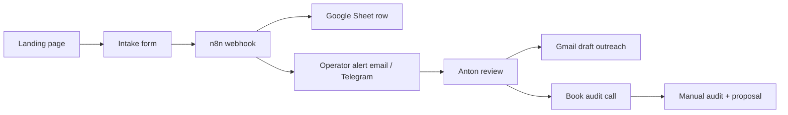

# Product A — Revenue machine implementation plan (v1)

**Product:** AI-ready website rebuild / website migration + enquiry capture + Lead Rescue for **US medspas, aesthetic clinics, and elective clinics**.

**Status:** Implementation plan — **manual-first v1**. No production runtime authorized by this doc alone.

**Anchor sentinel:** `<!-- PRODUCT_A_REVENUE_MACHINE_V1 -->`

<!-- PRODUCT_A_REVENUE_MACHINE_V1 -->

**Revision note (2026-06-20):** v1 stack is **Google Workspace + n8n + CorpFlowAI intake**. No third-party CRM, pipeline builder, or marketing-automation platform in the first version.

---

## 1. Purpose

Define the **smallest revenue machine** that can sell and deliver Product A without over-building infrastructure before the sales motion is proven.

**North star for v1:** a clinic owner can request an audit, Anton receives a clean lead record, and follow-up stays human-approved and traceable.

**Explicit deferral:** internal CRM inside CorpFlowAI Command Center is **future-only** — after manual workflow proves repeatability (see § 8).

---

## 2. Product A offer (buyer-facing)

| Element | v1 definition |
| ------- | ------------- |
| **Who** | US medspas, aesthetic clinics, elective clinics (Botox/fillers, laser, body contouring, med-spa skincare, elective wellness with booking friction). |
| **What** | AI-ready website rebuild or migration + enquiry capture hardening + Lead Rescue operating workflow (human operator, not a chatbot pitch). |
| **Primary CTA** | **Request a Website & Lead Rescue Audit** |
| **Outcome promise (allowed)** | Enquiries become visible, captured, and followed up — without forcing a CRM migration on day one. |
| **Outcome promise (forbidden)** | Guaranteed revenue, “never miss a lead again” (unqualified), fully automated sales machine. See `docs/marketing/BRAND_AND_CONVERSION_DOCTRINE.md`. |

Product A is **above-the-line**: managed workflow + website delivery for a vertical, not a generic AI wrapper. See `docs/strategy/ABOVE_THE_LINE_STRATEGY_DOCTRINE.md`.

---

## 3. Hard rule — v1 stack (non-negotiable)

**First version uses only the replacement stack in § 4.** Do not add external CRM, pipeline, hosted marketing-form, drip-automation, or calendar-to-CRM dependencies.

That means **no**:

- Third-party CRM pipelines or deal stages
- Hosted marketing forms tied to external CRM
- Drip automations, SMS blasts, or workflow-builder dependencies
- Calendar booking widgets that sync into external CRM
- UI copy, docs, or automation specs that imply an all-in-one marketing platform

**v1 source of truth:** Google Sheet (operator CRM) + Postgres only where CorpFlowAI native intake already exists.

---

## 4. Replacement stack (v1)

| Layer | Tool | Role |
| ----- | ---- | ---- |
| **Temporary CRM / pipeline** | Google Sheets | Single operator sheet — all pre-sale and in-audit leads until delivery handoff. |
| **Workflow spine** | n8n | Intake webhook → Sheet append → operator notification → optional Gmail draft creation. See `docs/automation-framework.md`. |
| **Outreach** | Gmail drafts | Human-approved email only — operator reviews and sends. No auto-send in v1. |
| **Audit calls** | Google Calendar **or** simple booking link (Calendly / Google Appointment Schedule) | Audit scheduling only; no CRM sync required. |
| **Intake surface** | CorpFlowAI native landing + form **or** Google Form (fallback) | Public capture; fields in § 6. |
| **Knowledge base** | Google Drive docs | Offer copy, audit checklist, objection handling, delivery SOPs, vertical notes. |
| **Future CRM (optional)** | CorpFlowAI Command Center | **After** manual motion is proven — not v1. |

---

## 5. v1 revenue flow (keep it simple)



**Step-by-step (v1):**

1. **Landing page** — Product A page with primary CTA *Request a Website & Lead Rescue Audit*.
2. **Intake form submit** — required fields captured (§ 6).
3. **Automation** — n8n receives payload → appends row to Google Sheet → notifies Anton (email and/or existing ops alert path).
4. **Anton review** — qualify/disqualify within 2 business days; update Sheet status column.
5. **Manual follow-up** — Gmail draft (review → send); offer audit call via Calendar link.
6. **Audit → close** — manual proposal; payment and delivery handoff per existing CorpFlow finance/runbook patterns when applicable.

**No branching automations in v1.** No lead scoring, no multi-step drips, no chatbot on the Product A page unless separately authorized.

---

## 6. Landing page + intake requirements

### 6.1 Primary CTA

- Button / hero action: **Request a Website & Lead Rescue Audit**
- Secondary (optional): *See what the audit covers* → anchor to on-page section or Drive doc summary link.

### 6.2 Required intake fields

| Field | Required | Notes |
| ----- | -------- | ----- |
| Clinic name | Yes | Legal or public-facing brand name. |
| Website URL | Yes | Current site; `https://` validated. |
| Contact name | Yes | Owner, manager, or marketing lead. |
| Email | Yes | Primary follow-up address. |
| Phone | No | Optional; US format hint in UI. |
| City / state | Yes | US clinic location (dropdown or text + state). |
| Biggest enquiry/booking problem | Yes | Free text; sales qualification signal. |

### 6.3 Post-submit UX

- Confirmation message: intake received; Anton (or CorpFlowAI) will review within 2 business days.
- No payment on page in v1.
- No external CRM thank-you redirect.
- Privacy: minimal — email used for audit scheduling only (align with site privacy policy).

### 6.4 Intake implementation options (pick one for v1)

| Option | Pros | Cons |
| ------ | ---- | ---- |
| **A — CorpFlowAI native form** | Brand control, can POST to `/api/automation/ingest` + n8n forward | Requires small runtime PR |
| **B — Google Form** | Fastest live; Sheets native | Weaker on-brand UX |

**Default recommendation:** Option A if a Product A route ships in the same sprint; Option B for same-day live test.

---

## 7. Google Sheet — temporary CRM schema

**Sheet name:** `Product A — US Clinic Leads` (operator copy in Google Drive).

| Column | Example | Notes |
| ------ | ------- | ----- |
| `received_at` | ISO timestamp | n8n writes on ingest |
| `status` | `new` / `reviewing` / `audit_scheduled` / `audit_done` / `proposal_sent` / `won` / `lost` / `nurture` | Manual updates by Anton |
| `clinic_name` | | From intake |
| `website` | | From intake |
| `contact_name` | | From intake |
| `email` | | From intake |
| `phone` | | Optional |
| `city_state` | | From intake |
| `biggest_problem` | | From intake |
| `source` | `product-a-landing` | UTM / referrer if available |
| `audit_call_at` | | Filled after booking |
| `notes` | | Operator free text |
| `next_action` | | e.g. *Send audit recap*, *Follow up Friday* |

**Rules:**

- Sheet is the **only** pre-sale pipeline in v1.
- Do not mirror into Command Center cockpit until buyer is active/paying (future handoff rules in § 8).
- Back up weekly (Drive version history is sufficient for v1).

---

## 8. n8n workflow spec (v1)

**Workflow name:** `product-a-us-clinic-intake-v1`

**Trigger:** Webhook POST (from native form or Google Form via Apps Script / n8n Google Form trigger).

**Steps:**

1. **Validate payload** — required fields present; reject incomplete with 400 + log.
2. **Append Google Sheet row** — map fields to § 7 columns; set `status=new`.
3. **Notify operator** — email to Anton and/or `corpflow.ops_alert.v1` forward per `docs/operations/TELEGRAM_ALERT_WIRING_PACKET_V1.md` pattern (best-effort).
4. **Create Gmail draft (optional, off by default)** — template: audit acknowledgement + Calendar link placeholder. Operator must enable node only after template review.

**Idempotency:** dedupe on `email + clinic_name + received_at` window (24h) to prevent double-submit noise.

**Event type (if using native ingest):** `intake.product_a.us_clinic.v1` via `POST /api/automation/ingest` per `docs/automation-framework.md`.

**Explicitly out of scope for this workflow:**

- Auto-send email
- CRM deal creation
- SMS / WhatsApp
- Payment links
- LLM enrichment of lead records

---

## 9. Gmail draft outreach (human-approved)

**v1 pattern:** n8n or operator creates **draft only**; Anton sends from Gmail after review.

**Draft A — intake acknowledgement (within 2 business days):**

- Subject: `Re: Website & Lead Rescue audit — {clinic_name}`
- Body: thank you; 1–2 sentences reflecting `biggest_problem`; link to book audit call; sign-off from Anton.

**Draft B — post-audit follow-up:**

- Summary of audit findings (3 bullets max); proposed scope (website + capture + Lead Rescue); no pricing guarantee language.

Store canonical templates in Google Drive: `Product A / Sales / Email templates v1`.

---

## 10. Audit call booking

**v1 options (choose one):**

| Option | Setup |
| ------ | ----- |
| Google Calendar appointment schedule | Free; lives on Anton’s calendar |
| Calendly free tier | Single event type: *Website & Lead Rescue Audit (30 min)* |

**Rules:**

- Booking link appears in acknowledgement email and optionally on thank-you page.
- No bi-directional CRM sync — operator copies `audit_call_at` into Sheet manually or via n8n Calendar trigger (optional v1.1).

---

## 11. Google Drive — knowledge base layout

```
Product A/
├── Offer/
│   ├── one-pager-website-lead-rescue-audit.md
│   └── audit-deliverable-checklist.md
├── Sales/
│   ├── email-templates-v1.md
│   ├── discovery-questions-us-clinics.md
│   └── objection-handling.md
├── Delivery/
│   ├── website-migration-checklist.md
│   ├── enquiry-capture-audit.md
│   └── lead-rescue-handoff-to-operator.md
└── Vertical/
    └── us-medspa-notes.md
```

Drive is **draft + operator reference** — repo runbooks remain production doctrine when they exist (e.g. Lead Rescue operator runbook for delivery phase).

---

## 12. Implementation phases

### Phase 0 — Docs + Sheet + Drive (same day)

- [ ] Create Google Sheet schema (§ 7)
- [ ] Create Drive folder structure (§ 11)
- [ ] Write audit checklist + email templates in Drive
- [ ] Confirm n8n webhook URL + Google Sheets credential on operator n8n instance

### Phase 1 — Intake live (target: 1–3 days)

- [x] Product A landing page with § 6 fields and primary CTA — `/product-a/us-clinics`
- [x] Form POST → `/api/product-a/intake` → automation forward + optional `N8N_PRODUCT_A_INTAKE_WEBHOOK_URL`
- [x] Payload spec + operator deploy checklist — `docs/product/PRODUCT_A_INTAKE_WEBHOOK.md`
- [ ] **Operator closeout:** deploy + one live test (checklist in webhook doc § *Operator deployment checklist*)
- [ ] Plausible / analytics event on submit (optional; `pa_intake_*` events wired in component)

### Phase 2 — Manual sales motion (target: first 5 audits)

- [ ] Anton runs 5 audit calls from Sheet-sourced leads
- [ ] Track conversion: intake → audit → proposal → paid
- [ ] Refine copy and audit checklist from real calls
- [ ] Document repeatable delivery steps in Drive

### Phase 3 — Delivery integration (only after first paid client)

- [ ] Hand off paid client to Lead Rescue delivery runbooks where applicable (`docs/operations/AI_LEAD_RESCUE_OPERATOR_RUNBOOK.md`, paid pilot onboarding)
- [ ] Website rebuild/migration as separate statement of work
- [ ] Still no external CRM — Sheet row moves to `won` + delivery checklist

### Phase 4 — Optional Command Center CRM (future gate)

**Gate criteria (all required):**

- ≥ 3 paid Product A clients **or** ≥ 10 qualified audits with documented repeat playbook
- Sheet + n8n motion documented and boring (no weekly firefighting)
- Anton explicit DECISION authorizing cockpit pipeline for Product A

**Future scope (not v1):**

- `/admin/product-a` or extended lead-rescue pipeline for US clinic vertical
- Postgres as system of record; Sheet retired or read-only archive

---

## 13. UI / copy guardrails

- Never show third-party CRM logos or “integrated with …” badges on Product A surfaces.
- CTA language stays audit-first, not “Buy now” or “Start automation.”
- Lead Rescue references must match managed-workflow doctrine — not chatbot-first.
- US clinic page is separate from Mauritius Lead Rescue surfaces unless explicitly cross-linked.

---

## 14. Related canonical docs

| Topic | Doc |
| ----- | --- |
| Automation ingest + n8n forward | `docs/automation-framework.md` |
| Product A intake webhook payload | `docs/product/PRODUCT_A_INTAKE_WEBHOOK.md` |
| Brand / no-guarantee language | `docs/marketing/BRAND_AND_CONVERSION_DOCTRINE.md` |
| Above-the-line positioning | `docs/strategy/ABOVE_THE_LINE_STRATEGY_DOCTRINE.md` |
| Lead Rescue delivery (post-sale) | `docs/operations/AI_LEAD_RESCUE_OPERATOR_RUNBOOK.md` |
| Sales vs delivery boundary | `docs/operations/AI_LEAD_RESCUE_SALES_TO_DELIVERY_HANDOFF.md` |
| Google Workspace delivery patterns | `docs/strategy/AI_DELIVERY_CAPABILITY_PLAYBOOK_V1.md` |
| Ops alerts | `docs/operations/TELEGRAM_ALERT_WIRING_PACKET_V1.md` |

---

## 15. Definition of done — v1 revenue machine

v1 is **done** when all of the following are true:

1. Live Product A landing page with correct intake fields and primary CTA.
2. Submit creates a Google Sheet row within 60 seconds (verified with test submission).
3. Anton receives operator notification on each new row.
4. At least one real audit booked and tracked through Sheet statuses.
5. Zero dependency on external CRM pipelines, forms, or automations.
6. Documentation in this file matches what is actually wired in n8n and on the page.

---

## Document history

| Version | Date (UTC) | Change |
| ------- | ---------- | ------ |
| v1 | 2026-06-20 | Initial plan — Google Sheets + n8n + manual follow-up; no external CRM in v1. |
